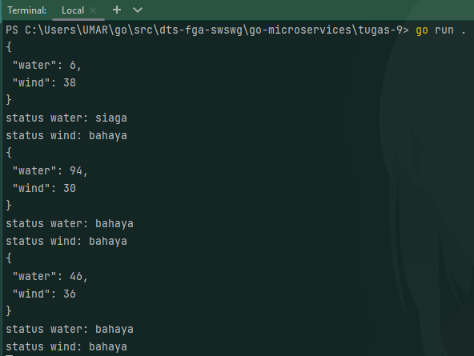

## Requirements
Make a service that POST data in JSON format randomly every 15 seconds with random number between 1-100 for water value and wind value. With status for water and wind as following:
- if the water is below 5 then status is safe (aman)
- if the water is between 6 - 8 then status is standby (siaga)
- if the water is above 8 then status is dangerous (bahaya)
- if wind is below 6 then status is safe (aman)
- if wind is between 7 - 15 then status is standby (siaga)
- if wind is above 15 then status is dangerous (bahaya)

POST request simulation is make to this url: https://jsonplaceholder.typicode.com/posts

## How to run
`go run .` or `go run *.go`

## Output
